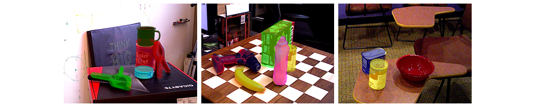
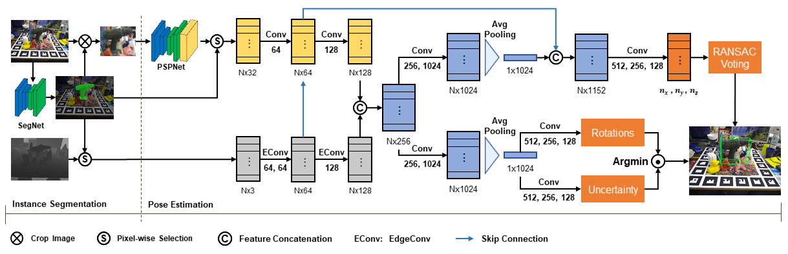

# Robust 6D Object Pose Estimation by Learning RGB-D Features


## Overview
This is an implementation of the paper "Robust 6D Object Pose Estimation by Learning RGB-D Features" ([arXiv](http://arxiv.org/abs/2003.00188)). Given an RGB-D image, our model predicts the 6D pose of each object in the scene.


## Dependencies
* Python 3.6
* PyTorch 1.0.1
* CUDA 9.0

## Installation
Compile the ransac voting layer:
```
cd path_to_object-posenet/lib/ransac_voting
python setup.py install --user
```
Compile the gpu version of knn:
```
cd path_to_object-posenet/lib/knn
python setup.py install --user
```

## Datasets
Download the preprocessed [LineMOD](https://drive.google.com/drive/folders/19ivHpaKm9dOrr12fzC8IDFczWRPFxho7):
```
unzip Linemod_preprocessed.zip
rm Linemod_preprocessed.zip
cd path_to_object-posenet/datasets/linemod
ln -s path_to_Linemod_preprocessed Linemod_preprocessed
```
Download the [YCB-Video Dataset](https://rse-lab.cs.washington.edu/projects/posecnn/):
```
unzip YCB_Video_Dataset.zip
rm YCB_Video_Dataset.zip
cd path_to_object-posenet/datasets/ycb
ln -s path_to_YCB_Video_Dataset YCB_Video_Dataset
```

## Training
```
# train a new model on LineMOD
python train.py --dataset 'linemod'

# train a new model on YCB-Video
python train.py --dataset 'ycb'

# resume training
python train.py --dataset 'ycb' --resume_posenet 'results/ycb/model_name.pth'
```

## Evaluation
Download the [trained model](https://drive.google.com/file/d/1YrEq9a7jU1xiWKE_AnyDIKceTRA0kTyT/view?usp=sharing):
```
unzip trained_models.zip
mv trained_models path_to_object-posenet/
rm trained_models.zip
```
If evaluate on LineMOD, please run:
```
python eval_linemod.py
```
If evaluate on YCB-Video, please download the YCB_Video_toolbox first:
```
cd path_to_object-posenet
git clone https://github.com/yuxng/YCB_Video_toolbox.git
cd YCB_Video_toolbox
unzip results_PoseCNN_RSS2018.zip
cd ..
cp assets/*.m YCB_Video_toolbox/
```
Run:
```
python eval_ycb.py
```
Then, download the [results of DenseFusion](https://drive.google.com/file/d/13AFspk91qCw0HJ7a6L_EpeTqILWHK6T0/view?usp=sharing) for comparison:
```
unzip densefusion_results.zip
mv densefusion_results/* path_to_object-posenet/YCB_Video_toolbox/
rmdir densefusion_results
rm densefusion_results.zip
```
We use MATLAB to get both quantative and qualitative results:
```
# matlab -softwareopengl
# compute accuracy
run evaluate_poses_keyframe.m
# plot accuracy curve
run plot_accuracy_keyframe.m
# visualize results
# mkdir path_to_object-posenet/YCB_Video_toolbox/pose_visual
run show_pose_results.m
```

## Citation
If you find our work helpful, please consider citing:
```
@article{tian2020robust,
  title={Robust 6D Object Pose Estimation by Learning RGB-D Features},
  author={Tian, Meng and Pan, Liang and Ang Jr, Marcelo H and Lee, Gim Hee},
  journal={arXiv preprint arXiv:2003.00188},
  year={2020}
}
```

## Acknowledgment
Our code is largely adapted form [DenseFusion](https://github.com/j96w/DenseFusion). The ransac voting layer is modified from [PVNet](https://github.com/zju3dv/pvnet/tree/master/lib/ransac_voting_gpu_layer).
